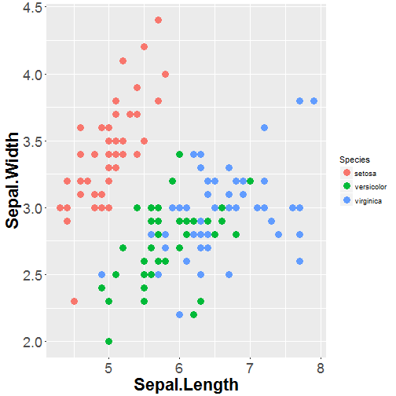
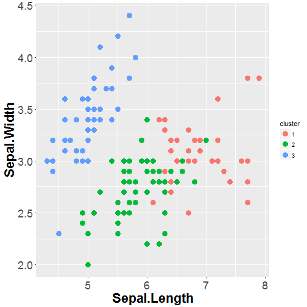

Clustering and classification
========================================================
css: index.css
type: sub-section

For IODS by Emma Kämäräinen

<br>
<br>
<br>
<br>

Powered by RMarkdown. The code for this presentation is  [here.](https://github.com/TuomoNieminen/Helsinki-Open-Data-Science/blob/master/docs/cluster_classification.Rpres)

Clustering and classification
========================================================
incremental: false

Classification:
- You know the number of classes
- The classification model is trained based on data
- Classify new observation

***

Clustering: 
- Unknown classes / number of classes is unknown
- Find groups within data based on similarity 

Clustering and classification
========================================================
incremental: false
autosize: true

- Linear discriminant analysis
- Distance measures
- K-means

Linear discriminant analysis
==================================================
autosize: true

Linear discriminant analysis (LDA) is a classification method. It can be used to model binary variables, like in logistic regression, or multiple class variables. The target variable needs to be categorical. 

It can be used to
- Find the variables that discriminate/separate the classes best
- Prediction of classes
- Dimension reduction (not covered here)

[This](http://machinelearningmastery.com/linear-discriminant-analysis-for-machine-learning/) is a good and simple blog post about LDA. R-Bloggers also have a post about LDA, see it [here](https://www.r-bloggers.com/computing-and-visualizing-lda-in-r/).

Linear discriminant analysis
==================================================
autosize: true

Linear discriminant analysis produces results based on the assumptions that
- your data has normally distributed variables
- each variable has the same variance

Because of the assumptions, the data might need scaling before fitting the model. The variables also need to be continuous. 

Let's see an example next to wrap our heads around what LDA is really doing.

LDA example
==================================================
autosize: true

<font size=6>

```
Call:
lda(Species ~ ., data = d)

Prior probabilities of groups:
    setosa versicolor  virginica 
 0.3333333  0.3333333  0.3333333 

Group means:
           Sepal.Length Sepal.Width Petal.Length Petal.Width
setosa       -1.0111914   0.8504137   -1.3006301  -1.2507035
versicolor    0.1119073  -0.6592236    0.2843712   0.1661774
virginica     0.8992841  -0.1911901    1.0162589   1.0845261

Coefficients of linear discriminants:
                    LD1         LD2
Sepal.Length  0.6867795  0.01995817
Sepal.Width   0.6688251  0.94344183
Petal.Length -3.8857950 -1.64511887
Petal.Width  -2.1422387  2.16413593

Proportion of trace:
   LD1    LD2 
0.9912 0.0088 
```
</font>

LDA example
==================================================
autosize: true



LDA predictions
==================================================
autosize: true

Classifying new observations:
- Based on the trained model LDA calculates the probabilities for the new observation for belonging in each of the classes
- The observation is classified to the class of the highest probability
- The math behind the probabilities can be seen [here](http://scikit-learn.org/stable/modules/lda_qda.html) for those who are interested. [Bayes theorem](https://en.wikipedia.org/wiki/Bayes'_theorem) is used to estimate the probabilities.
- You'll see how the predicting is done in the DataCamp exercises. 

Distance measures
==================================================
incremental: false
autosize: true

How to determine if observations are similar or dissimilar with each others?

- [Euklidean distance](https://en.wikipedia.org/wiki/Euclidean_distance)
- [Manhattan/Taxicab distance](https://en.wikipedia.org/wiki/Taxicab_geometry) (axis-aligned directions)
- [Jaccard index](https://en.wikipedia.org/wiki/Jaccard_index) (binary/categorical distance measure)
- [Hamming distance](https://en.wikipedia.org/wiki/Hamming_distance) (distance measure for words/strings)

K -means
==================================================
incremental: false
autosize: true

- *K*-means is possibly the oldest and used clustering method in many fields of study
- Pro: Easy to use and often finds a solution
- Con: Small change in the dataset can produce very different results
- Many variations of *k*-means: *k*-means++, *k*-medoids, *k*-medians... 
    
K-means algorithm
==================================================
incremental: false
autosize: true

1. Choose the number of clusters you want to have and pick initial cluster centroids.
2. Calculate distances between centroids and datapoints. 
3. For all the data points: Assign data point to cluster based on which centroid is closest.
4. Update centroids: within each cluster, calculate new centroid
5. Update clusters: Calculate distances between data points and updated centroids. If some other centroid is closer than the cluster centroid where the data point belongs, the data point changes cluster.

Continue updating steps until the centroids or the clusters do not change

K-means example
==================================================



***


Source: [This R-Blogges Post](https://www.r-bloggers.com/k-means-clustering-in-r/)
 
K-means notes
==================================================
incremental: false
autosize: true

Remarks about *k*-means:
- Distance measure in the algorithm: similarity/dissimilarity measure between data points
  - Different distance measures produce different output
  - Deciding the best distance is not
- Number of clusters as input
  - Many ways to find the optimal number of clusters
  - One way is to look at the total within cluster sum of squares (see next slide)
  - [Other ways](https://en.wikipedia.org/wiki/Determining_the_number_of_clusters_in_a_data_set): hierarchical clustering, silhouette method, cross validation ...

K-means: Total within sum of squares
==================================================
incremental: false
autosize: true

Total within sum of squares is calculated by adding the within cluster sum of squares (WCSS) of every cluster together. The WCSS can be calculated with the pattern 

$WCSS = \sum_i^N (x_i - centroid)^2$

So you are searching for the number of clusters, where the observations are closest to the cluster center. 
