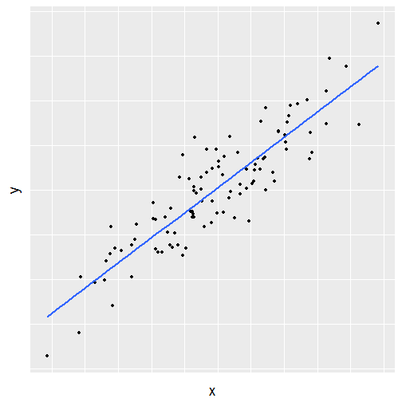
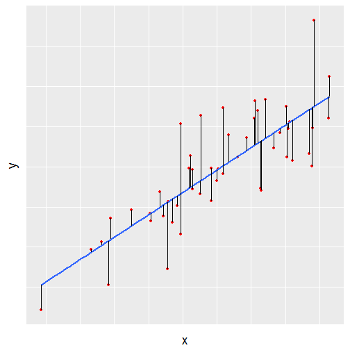
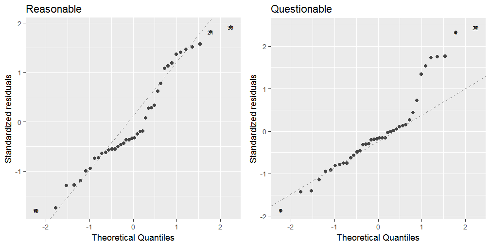
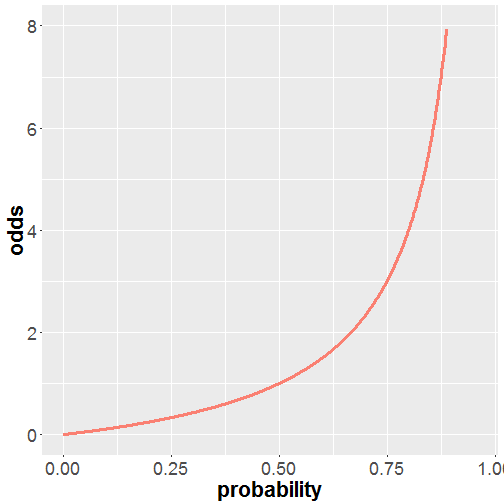

Introduction to Open Data Science
========================================================
incremental: false
autosize: true
transition: rotate

University of Helsinki, spring 2017
- Adunct professor Kimmo Vehkalahti with  
- Tuomo Nieminen and Emma Kämäräinen  

========================================================
type: prompt

<div align="center">
From data wrangling to exploration and modelling
</div><br>


Contents
========================================================
incremental: false

- Regression and model validation  
- Logistic regression
- Clustering and classification  
- Dimensionality reduction techniques  
- Multivariate statistical modelling  


Linear regression and model validation
========================================================
css: index.css
type: sub-section

For IODS by Tuomo Nieminen

<br>
<br>
<br>
<br>

Powered by RMarkdown. The code for this presentation is  [here.](https://github.com/TuomoNieminen/Helsinki-Open-Data-Science/blob/master/docs/regression.Rpres)

Linear regression models
========================================================
type: prompt
incremental: false

Simple regression


***

Multiple regression


What is a statistical model?
========================================================

A statistical model: 
- Embodies a set of assumptions and describes the generation of a sample from a population
- Represents the data generating process
- The uncertainty related to a sample of data is described using probability distributions

<!-- source: [wikipedia](https://en.wikipedia.org/wiki/Statistical_model) -->

Linear regression models
========================================================

Linear regression is an approach for modeling the relationship between a dependent variable $\boldsymbol{y}$ and one or more explanatory variables $\boldsymbol{X}$.  

There are many applications for linear models such as

- Prediction or forecasting
- Quantifying the strength of the relationship between $\boldsymbol{y}$ and $\boldsymbol{x}$


Simple regression
========================================================

In a simple case, the model includes one explanatory variable $\boldsymbol{x}$

$\boldsymbol{y} =  \alpha + \beta \boldsymbol{x} + \boldsymbol{\epsilon}$

R:  
```lm(y ~ x)```  

***



Multiple regression
========================================================

The model can also include more than one explanatory variable

$$\boldsymbol{y} = \alpha + \beta_1 \boldsymbol{x}_1 + \beta_2 \boldsymbol{x}_2 + \boldsymbol{\epsilon}$$

R:  
```lm(y ~ x1 + x2)```  

***


Assumptions of linear regression models
========================================================

In linear regression, it is assumed that the relationship between the target variable $\boldsymbol{y}$ and the parameters ($\alpha$, $\boldsymbol{\beta}$) is *linear*:

$$\boldsymbol{y} = \boldsymbol{\alpha} +  \boldsymbol{X} \boldsymbol{\beta} + \boldsymbol{\epsilon}$$

- The goal is to estimate the parameters $\alpha$ and $\boldsymbol{\beta}$, which describe the relationship with the explanatory variables $\boldsymbol{X}$
- An unobservable random variable ($\boldsymbol{\epsilon}$) is assumed to add noise to the observations
- Often it is reasonable to assume $\boldsymbol{\epsilon} \sim N(0, \sigma^2)$

<!-- source: [wikipedia](https://en.wikipedia.org/wiki/Linear_regression) -->

Structure of a linear model
========================================================
In the simple linear equation $\boldsymbol{y} =  \alpha + \beta \boldsymbol{x} + \boldsymbol{\epsilon}$

- $\boldsymbol{y}$ is the target variable: we wish to predict the values of $\boldsymbol{y}$ using the values of $\boldsymbol{x}$.
- $\alpha + \beta \boldsymbol{x}$ is the systematic part of the model.
- $\beta$ quantifies the relationship between $\boldsymbol{y}$ and  $\boldsymbol{x}$.
- $\boldsymbol{\epsilon}$ describes the errors (or the uncertainty) of the model


Finding the model
========================================================
The best model is found by minimizing the prediction errors that the model would make

- $\hat{\boldsymbol{y}} = \hat{\alpha} + \hat{\beta} \boldsymbol{x}$ are the predictions
- $\boldsymbol{\hat{\epsilon}} = \hat{\boldsymbol{y}} - \boldsymbol{y}$ are the prediction errors, called residuals
- The model is found by minimizing the sum of squared residuals

***



Interpreting the parameters
========================================================
When the model is $$\boldsymbol{y} = \alpha + \beta_1 \boldsymbol{x}_1 + \beta_2 \boldsymbol{x}_2 + \boldsymbol{\epsilon}$$

- The main interest is to estimate the $\boldsymbol{\beta}$ parameters
- Interpretation of an estimate $\hat{\beta_1} = 2$: 
  - When $x_1$ increases by one unit, the average change in $y$ is 2 units, given that the other variables (here $x_2$) do not change.

R linear model summary()
========================================================
class: small-code
incremental: false

<small>
For a quick rundown of interpreting R's regression summary, see the 'Calling summary' section of [this blog post](http://blog.yhat.com/posts/r-lm-summary.html) or read about coefficients and p-values [here](http://blog.minitab.com/blog/adventures-in-statistics-2/regression-analysis-how-do-i-interpret-r-squared-and-assess-the-goodness-of-fit)
</small>


```

Call:
lm(formula = Y ~ some_variable)

Residuals:
    Min      1Q  Median      3Q     Max 
-5.2528 -1.8261 -0.1636  1.5288  5.8723 

Coefficients:
              Estimate Std. Error t value Pr(>|t|)   
(Intercept)   -0.04364    0.49417  -0.088  0.93026   
some_variable  1.81379    0.58925   3.078  0.00463 **
---
Signif. codes:  0 '***' 0.001 '**' 0.01 '*' 0.05 '.' 0.1 ' ' 1

Residual standard error: 2.643 on 28 degrees of freedom
Multiple R-squared:  0.2528,	Adjusted R-squared:  0.2262 
F-statistic: 9.475 on 1 and 28 DF,  p-value: 0.004626
```

Advanced example: Polynomial terms
========================================================
incremental: false

The linearity assumption isn't as restrictive as one could imagine.  

It is possible to add polynomial terms to the model if the effect of a variable is non-linear

$$\boldsymbol{y} = \alpha + \beta_1 \cdot \boldsymbol{x} + \beta_2 \cdot \boldsymbol{x}^2 + \boldsymbol{\epsilon}$$

R:  
```lm(y ~ x + I(x^2))```  

***


Model validation
========================================================
type: prompt


Model assumptions
========================================================
A statistical model always includes several assumptions which describe the data generating process.  

- How well the model describes the phenomenom of interest, depends on how well the assumptions fit reality.
- In a linear regression model an obvious assumption is linearity: The target variable is modelled as a linear combination of the model parameters.
- Usually it is assumed that the errors are normally distributed.


Assumptions of linear regression models
========================================================
Analyzing the *residuals* of the model provides a method to exlopore the validity of the model assumptions. A lot of interesting assumptions are included in the expression 

$$\boldsymbol{\epsilon} \sim N(0, \sigma^2)$$

- The errors are normally distributed
- The errors are not correlated
- The errors have constant variance, $\sigma^2$
- The size of a given error does not depend on the explanatory variables

Normality of the errors (QQ-plot)
========================================================

QQ-plot of the residuals provides a method to explore the assumption that the errors of the model are normally distributed




Constant variance of errors
========================================================

The constant variance assumption implies that the size of the errors should not depend on the explanatory variables. 

This can be explored with a simple scatter plot of residuals versus model predictions.

**Any** patter in the scatter plot implies a problem with the assumptions

***


Leverage of observations (1)
========================================================

Leverage measures how much impact a single observation has on the model. 

- Residuals vs leverage plot can help identify which observations have an unusually high impact.
- The next two slides show four examples.  
- Each row of two plots defines a *data - model validation* pair.

Leverage of observations (2)
========================================================


Leverage of observations (3)
========================================================


Update treshold
========================================================
type: alert

Please note that the following slides are drafts and subject to changes.


========================================================


Logistic regression and cross-validation
========================================================
type: sub-section

For IODS by Tuomo Nieminen

<br>
<br>
<br>
<br>

Powered by RMarkdown. The code for this presentation is  [here.](https://github.com/TuomoNieminen/Helsinki-Open-Data-Science/blob/master/docs/logistic_regression.Rpres)


Logistic regression
========================================================
type: prompt
incremental: false

Odds and probability


***

Predicting binary outcomes


A conditional look at regression
========================================================

In regression analysis, the target variable $\boldsymbol{Y}$ is modelled as a linear combination of the model parameters and the explanatory variables $\boldsymbol{X}$

$$\boldsymbol{Y} = \boldsymbol{\alpha} + \boldsymbol{\beta}\boldsymbol{X} + \boldsymbol{\epsilon}$$

Another way to express this is to use *conditional expectation*

$$E[\boldsymbol{Y} \mid \boldsymbol{X}] = \boldsymbol{\alpha} + \boldsymbol{\beta}\boldsymbol{X}$$

So, linear regression is a model for the (conditional) expected value of Y.


Regression for binary outcomes
========================================================

If the target variable $Y$ is *binary*, taking only the values 0 ("failure") or 1 ("success"), with probability $p$, then 

$$E[Y] = p$$

- **The goal** in logistic regression is to define a linear model for the probability of "success" ($p$, the expected value of $Y$)
- The problem is that $p$ only takes on values between 0 and 1
- A possible predictor can take on any value. There is no way to use multiplication and addition to restrict the predictors values to the range of $p$. What to do?

Odds
========================================================

The ratio of expected "successes" to "failures" are called the odds:

$$\frac{p}{1-p}$$

- Odds are an alternative way of expressing probabilities
- Higher odds corresponds to a higher probability of success
- The value of odds ranges from zero to infinity

***

<small> *Odds of 2 to 1: the probability of success is twice as likely as the probability of failure, when p = 2/3.*</small>
<br>


The logit function
========================================================
incremental: false

To transform $p$ into a completely unrestricted scale, we can take the logarithm of odds:

$$log\left( \frac{p}{1 - p} \right) \in [- \infty, \infty]$$

- The (natural) logarithm of odds is called the *logit function*.
- The possible values are all the real numbers (unrestricted).

***


Simple logistic regression
========================================================

In a simple case, the logistic regression model for the expected value $p$ of a binary variable $Y$, is:

$$log\left( \frac{\boldsymbol{p}}{1 - \boldsymbol{p}} \right) = \alpha + \beta \boldsymbol{x} + \boldsymbol{\epsilon}$$

R:  
`glm(Y ~ X, family = "binomial")`

***
 


Odds ratio
========================================================

The ratio of two odds is called the odds ratio. It can be computed by the following steps:

1. Compute the odds of "success" ($Y = 1$) for individuals who have the property $X$. 
2. Compute the odds of "success" ($Y = 1$) for individuals who **do not** have property $X$.
3. Divide the odds from step 1 by the odds from step 2 to obtain the odds ratio (OR).

Odds ratio can be used to quantify the relationship between $X$ and $Y$. Odds **higher than 1** mean that $X$ is **positively associated** with "success".

Odds ratio example (1)
========================================================

- *X = "has X"*
- *X_ = "doesn't have X"*
- *1 = "success"*
- *0 = "failure"*

<small>toy data:</small>

|      |  X| X_| total|
|:-----|--:|--:|-----:|
|1     | 10| 16|    26|
|0     | 15|  4|    19|
|total | 25| 20|    45|


***

The following probabilities can be calculated from the (toy) data:  

- $P(Y = 1 \mid X) = 10 / 25 = 0.4$
- $P(Y = 0 \mid X) = 15 / 25 = 0.6$
- $P(Y = 1 \mid X\_) = 16 / 20  = 0.8$
- $P(Y = 0 \mid X\_) = 4 / 20 = 0.2$  


Odds ratio example (2)
========================================================
left: 85%

Odds is the ratio of successes to failures:

- $Odds(Y \mid X) = \frac{P(Y = 1 \mid X)}{P(Y = 0 \mid X)} = \frac{0.4}{0.6} = \frac{2}{3}$
- $Odds(Y \mid X\_) = \frac{P(Y = 1 \mid X\_)}{P(Y = 0 \mid X\_)} =\frac{0.8}{0.2} = 4$

Odds ratio (OR) is the ratio of the two odds:

$$OR = \frac{Odds(Y \mid X)}{Odds(Y \mid X\_)} = \frac{2/3}{4} = \frac{1}{6}$$

***
<br><br><br><br><br>

<small>toy data:</small>

|      |  X| X_| total|
|:-----|--:|--:|-----:|
|1     | 10| 16|    26|
|0     | 15|  4|    19|
|total | 25| 20|    45|


Interpreting the parameters of logistic regression
========================================================
From the fact that the computational target variable in the logistic regression model is the log of odds, it follows that applying the exponent function to the fitted  values gives the odds:

$$\exp \left( log\left( \frac{\hat{\boldsymbol{p}}}{1 - \hat{\boldsymbol{p}}} \right) \right) = \frac{\hat{\boldsymbol{p}}}{1 - \hat{\boldsymbol{p}}}.$$

The exponents of the coefficients can be interpret as odds ratios between a unit change (vs no change) in the corresponding explanatory variable.

$$exp(\hat{\beta_x}) = Odds(Y \mid x + 1) / Odds(Y \mid x)$$

Cross-validation
========================================================
type: prompt


<br>
<small>*https://prateekvjoshi.files.wordpress.com/2013/06/cross-validation.png*</small>


Training and testing sets
========================================================

A statistical model can be used to make predictions. An intuitive way of comparing different models is to test their predictive power on unseen data.

- The available data can be split into training and testing sets
- Only the training data is used to find the model
- The testing data is then used to make predictions and evaluate the model performance

</img>

Accuracy and error
========================================================
In order to assert model performance, we need to measure it somehow. 

- Depending on the nature of the target variable, different measures might make sense.
- If the task is *binary classification* such as in logistic regression, it is straight forward to calculate the proportion of correctly classified observations
- The proportion of incorrectly classified observations is the error (penalty, loss)


Cross-validation (1)
========================================================
Cross-validation is a powerful general technique for assessing how the results of a statistical analysis will generalize to an independent data set.

- Utilizes the idea of training and testing sets effectively
- Mainly used in settings where one wants to estimate how accurately a predictive model will perform in practice
- Gives a reasonable measure of performance on unseen data
- Can be used to compare different models to choose the best performing one

Cross-validation (2)
========================================================

One round of cross-validation involves 

- Partitioning a sample of data into complementary subsets
- Performing the analysis on one subset (the training set, larger)
- Validating the analysis on the other subset (the testing set, smaller). 

This process is repeated so that eventually all of the data is used for both training and testing.


K-fold cross-validation
========================================================

Below is an example of 4-fold cross-validation 


The data is divided into subsets K times and eventually all the data is used for both training and testing.  

