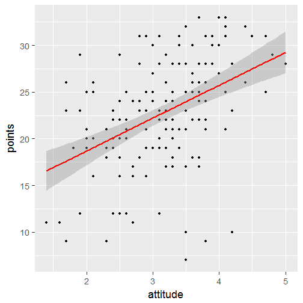
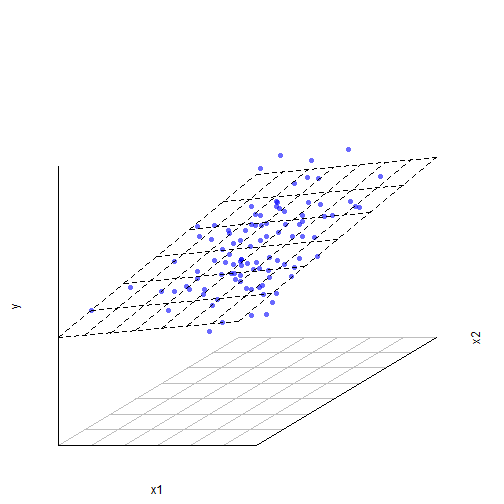
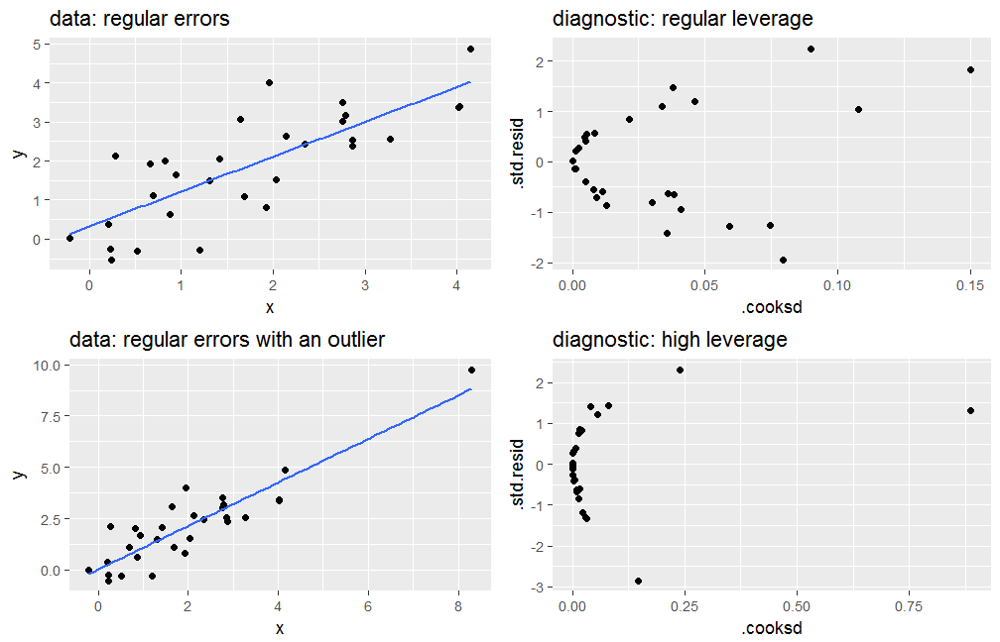
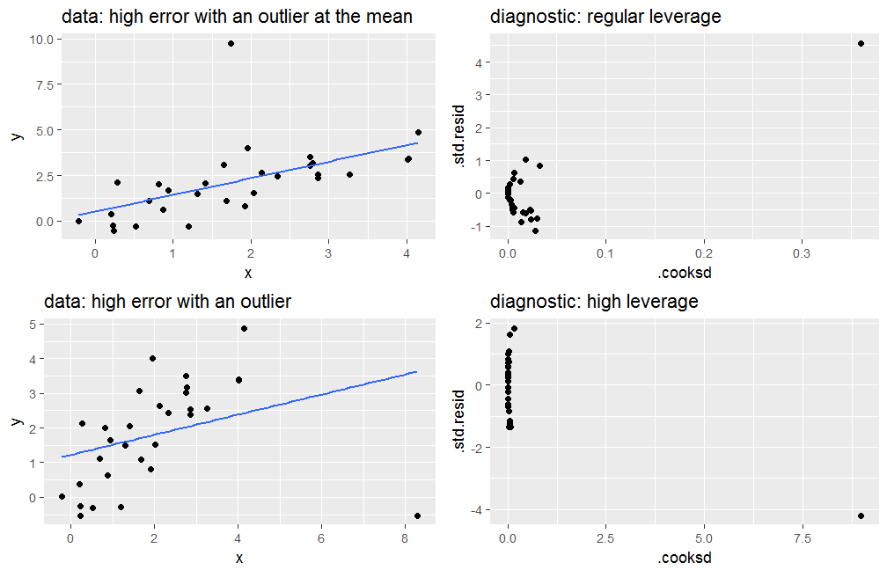
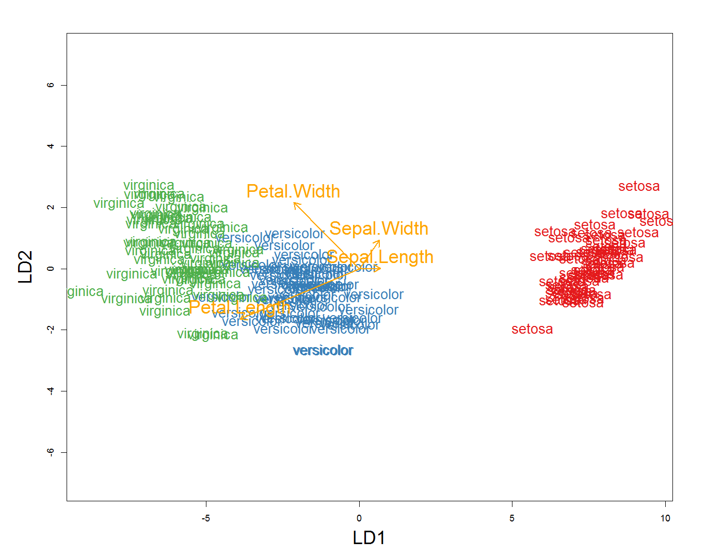

Introduction to Open Data Science
========================================================
incremental: false
autosize: true
transition: rotate

University of Helsinki, spring 2017
- Adjunct professor Kimmo Vehkalahti with  
- Tuomo Nieminen and Emma Kämäräinen  

========================================================
type: prompt

<div align="center">
From data wrangling to exploration and modelling
</div><br>


Contents
========================================================
incremental: false

- Regression and model validation  
- Logistic regression
- Clustering and classification  
- Dimensionality reduction techniques  
- Multivariate statistical modelling  


Linear regression and model validation
========================================================
css: index.css
type: sub-section

For IODS by Tuomo Nieminen

<br>
<br>
<br>
<br>

Powered by RMarkdown. The code for this presentation is  [here.](https://github.com/TuomoNieminen/Helsinki-Open-Data-Science/blob/master/docs/regression.Rpres)

Linear regression models
========================================================
type: prompt
incremental: false

Simple regression


***

Multiple regression


What is a statistical model?
========================================================

A statistical model: 
- Embodies a set of assumptions and describes the generation of a sample from a population
- Represents the data generating process
- The uncertainty related to a sample of data is described using probability distributions

<!-- source: [wikipedia](https://en.wikipedia.org/wiki/Statistical_model) -->

Linear regression models
========================================================

Linear regression is an approach for modeling the relationship between a dependent variable $\boldsymbol{y}$ and one or more explanatory variables $\boldsymbol{X}$.  

There are many applications for linear models such as

- Prediction or forecasting
- Quantifying the strength of the relationship between $\boldsymbol{y}$ and $\boldsymbol{x}$


Simple regression
========================================================

In a simple case, the model includes one explanatory variable $\boldsymbol{x}$

$\boldsymbol{y} =  \alpha + \beta \boldsymbol{x} + \boldsymbol{\epsilon}$

R:  
```lm(y ~ x)```  

***


Multiple regression
========================================================

The model can also include more than one explanatory variable

$$\boldsymbol{y} = \alpha + \beta_1 \boldsymbol{x}_1 + \beta_2 \boldsymbol{x}_2 + \boldsymbol{\epsilon}$$

R:  
```lm(y ~ x1 + x2)```  

***



Assumptions of linear regression models
========================================================

In linear regression, it is assumed that the relationship between the target variable $\boldsymbol{y}$ and the parameters ($\alpha$, $\boldsymbol{\beta}$) is *linear*:

$$\boldsymbol{y} = \boldsymbol{\alpha} +  \boldsymbol{X} \boldsymbol{\beta} + \boldsymbol{\epsilon}$$

- The goal is to estimate the parameters $\alpha$ and $\boldsymbol{\beta}$, which describe the relationship with the explanatory variables $\boldsymbol{X}$
- An unobservable random variable ($\boldsymbol{\epsilon}$) is assumed to add noise to the observations
- Often it is reasonable to assume $\boldsymbol{\epsilon} \sim N(0, \sigma^2)$

<!-- source: [wikipedia](https://en.wikipedia.org/wiki/Linear_regression) -->

Structure of a linear model
========================================================
In the simple linear equation $\boldsymbol{y} =  \alpha + \beta \boldsymbol{x} + \boldsymbol{\epsilon}$

- $\boldsymbol{y}$ is the target variable: we wish to predict the values of $\boldsymbol{y}$ using the values of $\boldsymbol{x}$.
- $\alpha + \beta \boldsymbol{x}$ is the systematic part of the model.
- $\beta$ quantifies the relationship between $\boldsymbol{y}$ and  $\boldsymbol{x}$.
- $\boldsymbol{\epsilon}$ describes the errors (or the uncertainty) of the model


Finding the model
========================================================
The best model is found by minimizing the prediction errors that the model would make

- $\hat{\boldsymbol{y}} = \hat{\alpha} + \hat{\beta} \boldsymbol{x}$ are the predictions
- $\boldsymbol{\hat{\epsilon}} = \hat{\boldsymbol{y}} - \boldsymbol{y}$ are the prediction errors, called residuals
- The model is found by minimizing the sum of squared residuals

***


Interpreting the parameters
========================================================
When the model is $$\boldsymbol{y} = \alpha + \beta_1 \boldsymbol{x}_1 + \beta_2 \boldsymbol{x}_2 + \boldsymbol{\epsilon}$$

- The main interest is to estimate the $\boldsymbol{\beta}$ parameters
- Interpretation of an estimate $\hat{\beta_1} = 2$: 
  - When $x_1$ increases by one unit, the average change in $y$ is 2 units, given that the other variables (here $x_2$) do not change.

R linear model summary()
========================================================
class: small-code
incremental: false

<small>
For a quick rundown of interpreting R's regression summary, see the 'Calling summary' section of [this blog post](http://blog.yhat.com/posts/r-lm-summary.html) or read about coefficients and p-values [here](http://blog.minitab.com/blog/adventures-in-statistics-2/regression-analysis-how-do-i-interpret-r-squared-and-assess-the-goodness-of-fit)
</small>


```

Call:
lm(formula = Y ~ some_variable)

Residuals:
    Min      1Q  Median      3Q     Max 
-5.2528 -1.8261 -0.1636  1.5288  5.8723 

Coefficients:
              Estimate Std. Error t value Pr(>|t|)   
(Intercept)   -0.04364    0.49417  -0.088  0.93026   
some_variable  1.81379    0.58925   3.078  0.00463 **
---
Signif. codes:  0 '***' 0.001 '**' 0.01 '*' 0.05 '.' 0.1 ' ' 1

Residual standard error: 2.643 on 28 degrees of freedom
Multiple R-squared:  0.2528,	Adjusted R-squared:  0.2262 
F-statistic: 9.475 on 1 and 28 DF,  p-value: 0.004626
```

Advanced example: Polynomial terms
========================================================
incremental: false

The linearity assumption isn't as restrictive as one could imagine.  

It is possible to add polynomial terms to the model if the effect of a variable is non-linear

$$\boldsymbol{y} = \alpha + \beta_1 \cdot \boldsymbol{x} + \beta_2 \cdot \boldsymbol{x}^2 + \boldsymbol{\epsilon}$$

R:  
```lm(y ~ x + I(x^2))```  

***


Model validation
========================================================
type: prompt


Model assumptions
========================================================
A statistical model always includes several assumptions which describe the data generating process.  

- How well the model describes the phenomenom of interest, depends on how well the assumptions fit reality.
- In a linear regression model an obvious assumption is linearity: The target variable is modelled as a linear combination of the model parameters.
- Usually it is assumed that the errors are normally distributed.


Assumptions of linear regression models
========================================================
Analyzing the *residuals* of the model provides a method to exlopore the validity of the model assumptions. A lot of interesting assumptions are included in the expression 

$$\boldsymbol{\epsilon} \sim N(0, \sigma^2)$$

- The errors are normally distributed
- The errors are not correlated
- The errors have constant variance, $\sigma^2$
- The size of a given error does not depend on the explanatory variables

Normality of the errors (QQ-plot)
========================================================

QQ-plot of the residuals provides a method to explore the assumption that the errors of the model are normally distributed


Constant variance of errors
========================================================

The constant variance assumption implies that the size of the errors should not depend on the explanatory variables. 

This can be explored with a simple scatter plot of residuals versus model predictions.

**Any** patter in the scatter plot implies a problem with the assumptions

***


Leverage of observations (1)
========================================================

Leverage measures how much impact a single observation has on the model. 

- Residuals vs leverage plot can help identify which observations have an unusually high impact.
- The next two slides show four examples.  
- Each row of two plots defines a *data - model validation* pair.

Leverage of observations (2)
========================================================




Leverage of observations (3)
========================================================




Logistic regression and cross-validation
========================================================
type: sub-section

For IODS by Tuomo Nieminen

<br>
<br>
<br>
<br>

Powered by RMarkdown. The code for this presentation is  [here.](https://github.com/TuomoNieminen/Helsinki-Open-Data-Science/blob/master/docs/logistic_regression.Rpres)


Logistic regression
========================================================
type: prompt
incremental: false

Odds and probability


***

Predicting binary outcomes


A conditional look at regression
========================================================

In regression analysis, the target variable $\boldsymbol{Y}$ is modelled as a linear combination of the model parameters and the explanatory variables $\boldsymbol{X}$

$$\boldsymbol{Y} = \boldsymbol{\alpha} + \boldsymbol{X}\boldsymbol{\beta} + \boldsymbol{\epsilon}$$

Another way to express this is to use *conditional expectation*

$$E[\boldsymbol{Y} \mid \boldsymbol{X}] = \boldsymbol{\alpha} + \boldsymbol{X}\boldsymbol{\beta}$$

So, linear regression is a model for the (conditional) expected value of Y.


Regression for binary outcomes
========================================================

If the target variable $Y$ is *binary*, taking only the values 

- 0 ("failure")
- 1 ("success")

with probability $p$, then $E[Y] = p$.

- **The goal** in logistic regression is to define a linear model for the probability of "success" ($p$, the expected value of $Y$)
- The problem is that $p$ only takes on values between 0 and 1
- A possible predictor can take on any value. There is no way to use multiplication and addition to restrict the predictors values to the range of $p$. What to do?

Odds
========================================================
left: 55%

The ratio of expected "successes" to "failures" are called the odds:

$$\frac{p}{1-p}$$

- Odds are an alternative way of expressing probabilities
- Higher odds corresponds to a higher probability of success
- The value of odds ranges from zero to infinity

***

<small> *Odds of 2 to 1: the probability of success is twice as likely as the probability of failure, when p = 2/3.*</small>
<br>


The logit function
========================================================
left: 55%

To transform $p$ into a completely unrestricted scale, we can take the logarithm of odds:

$$log\left( \frac{p}{1 - p} \right) \in [- \infty, \infty]$$

- The (natural) logarithm of odds is called the *logit function*.
- The possible values are all the real numbers (unrestricted).

***


Simple logistic regression
========================================================
left: 55%

In a simple case, the logistic regression model for the expected value $p$ of a binary variable $Y$, is:

$$log\left( \frac{p}{1 - p} \right) = \alpha + \beta \boldsymbol{x} + \boldsymbol{\epsilon}$$

which implies

$$P(Y_i = 1) = \frac{1}{1 + e^{-\alpha - \beta \cdot x_i}} = p_i$$

***
 


Odds ratio
========================================================

The ratio of two odds is called the odds ratio. It can be computed by the following steps:

1. Compute the odds of "success" ($Y = 1$) for individuals who have the property $X$. 
2. Compute the odds of "success" ($Y = 1$) for individuals who **do not** have property $X$.
3. Divide the odds from step 1 by the odds from step 2 to obtain the odds ratio (OR).

Odds ratio can be used to quantify the relationship between $X$ and $Y$. Odds **higher than 1** mean that $X$ is **positively associated** with "success".

Odds ratio example (1)
========================================================

- *X = "has X"*
- *X_ = "doesn't have X"*
- *1 = "success"*
- *0 = "failure"*

<small>toy data:</small>

|      |  X| X_| total|
|:-----|--:|--:|-----:|
|1     | 10| 16|    26|
|0     | 15|  4|    19|
|total | 25| 20|    45|


***

The following conditional probabilities can be calculated from the (toy) data:  

- $P(Y = 1 \mid X) = 10 / 25 = 0.4$
- $P(Y = 0 \mid X) = 15 / 25 = 0.6$
- $P(Y = 1 \mid X\_) = 16 / 20  = 0.8$
- $P(Y = 0 \mid X\_) = 4 / 20 = 0.2$  


Odds ratio example (2)
========================================================
left: 85%

Odds is the ratio of successes to failures:

- $Odds(Y \mid X) = \frac{P(Y = 1 \mid X)}{P(Y = 0 \mid X)} = \frac{0.4}{0.6} = \frac{2}{3}$
- $Odds(Y \mid X\_) = \frac{P(Y = 1 \mid X\_)}{P(Y = 0 \mid X\_)} =\frac{0.8}{0.2} = 4$

Odds ratio (OR) is the ratio of the two odds:

$$OR = \frac{Odds(Y \mid X)}{Odds(Y \mid X\_)} = \frac{2/3}{4} = \frac{1}{6}$$

***
<br><br><br><br>

<small>toy data:</small>

|      |  X| X_| total|
|:-----|--:|--:|-----:|
|1     | 10| 16|    26|
|0     | 15|  4|    19|
|total | 25| 20|    45|


Interpreting the parameters of logistic regression
========================================================
From the fact that the computational target variable in the logistic regression model is the log of odds, it follows that applying the exponent function to the fitted  values gives the odds:

$$\exp \left( log\left( \frac{\hat{p}}{1 - \hat{p}} \right) \right) = \frac{\hat{p}}{1 - \hat{p}}.$$

The **exponents of the coefficients** can be interpret as **odds ratios** between a unit change (vs no change) in the corresponding explanatory variable.

$$exp(\hat{\beta_x}) = Odds(Y \mid x + 1) / Odds(Y \mid x)$$

Cross-validation
========================================================
type: prompt


<br>
<small>*https://prateekvjoshi.files.wordpress.com/2013/06/cross-validation.png*</small>


Training and testing sets
========================================================

A statistical model can be used to make predictions. An intuitive way of comparing different models is to test their predictive power on unseen data.

- The available data can be split into training and testing sets
- Only the training data is used to find the model
- The testing data is then used to make predictions and evaluate the model performance

</img>

Accuracy and error
========================================================
In order to assert model performance, we need to measure it somehow. 

- Depending on the nature of the target variable, different measures might make sense.
- If the task is *binary classification* such as in logistic regression, it is straight forward to calculate the proportion of correctly classified observations
- The proportion of incorrectly classified observations is the error (penalty, loss)


Cross-validation (1)
========================================================
Cross-validation is a powerful general technique for assessing how the results of a statistical analysis will generalize to an independent data set.

- Utilizes the idea of training and testing sets effectively
- Mainly used in settings where one wants to estimate how accurately a predictive model will perform in practice
- Gives a reasonable measure of performance on unseen data
- Can be used to compare different models to choose the best performing one

Cross-validation (2)
========================================================

One round of cross-validation involves 

- Partitioning a sample of data into complementary subsets
- Performing the analysis on one subset (the training set, larger)
- Validating the analysis on the other subset (the testing set, smaller). 

This process is repeated so that eventually all of the data is used for both training and testing.


K-fold cross-validation
========================================================

Below is an example of 5-fold cross-validation 


The data is divided into subsets K times and eventually all the data is used for both training and testing.  


Clustering and classification
========================================================
css: index.css
type: sub-section

For IODS by Emma Kämäräinen

<br>
<br>
<br>
<br>

Powered by RMarkdown. The code for this presentation is  [here.](https://github.com/TuomoNieminen/Helsinki-Open-Data-Science/blob/master/docs/cluster_classification.Rpres)


Clustering and classification
========================================================
incremental: false


Classification:
- You know the classes
- The classification model is trained based on data
- Classify new observations

***

Clustering: 
- Unknown classes / number of classes is unknown
- Find groups within data based on similarity of the observations


Clustering and classification
========================================================
incremental: false
autosize: true

- Linear discriminant analysis
- Distance measures
- K-means

Linear discriminant analysis
==================================================
autosize: true

Linear discriminant analysis (LDA) is a classification method. It can be used to model binary variables, like in logistic regression, or multiple class variables. The target variable needs to be categorical. 

It can be used to
- Find the variables that discriminate/separate the classes best
- Predict the classes of new data
- Dimension reduction (not covered here)

[This](http://machinelearningmastery.com/linear-discriminant-analysis-for-machine-learning/) is a good and simple blog post about LDA. R-Bloggers also have a post about LDA, see it [here](https://www.r-bloggers.com/computing-and-visualizing-lda-in-r/).

Linear discriminant analysis
==================================================
autosize: true

Linear discriminant analysis produces results based on the assumptions that 
- variables are normally distributed (on condition of the classes)
- each variable has the same variance

Because of the assumptions, the data might need scaling before fitting the model. The variables also need to be continuous. 

Let's see an example next to wrap our heads around what LDA is really doing.

LDA example
==================================================
autosize: true

<font size=6>

```
Call:
lda(Species ~ ., data = d)

Prior probabilities of groups:
    setosa versicolor  virginica 
 0.3333333  0.3333333  0.3333333 

Group means:
           Sepal.Length Sepal.Width Petal.Length Petal.Width
setosa       -1.0111914   0.8504137   -1.3006301  -1.2507035
versicolor    0.1119073  -0.6592236    0.2843712   0.1661774
virginica     0.8992841  -0.1911901    1.0162589   1.0845261

Coefficients of linear discriminants:
                    LD1         LD2
Sepal.Length  0.6867795  0.01995817
Sepal.Width   0.6688251  0.94344183
Petal.Length -3.8857950 -1.64511887
Petal.Width  -2.1422387  2.16413593

Proportion of trace:
   LD1    LD2 
0.9912 0.0088 
```
</font>

LDA predictions
==================================================
autosize: true

Classifying new observations:
- Based on the trained model LDA calculates the probabilities for the new observation for belonging in each of the classes
- The observation is classified to the class of the highest probability
- The math behind the probabilities can be seen [here](http://scikit-learn.org/stable/modules/lda_qda.html) for those who are interested. [Bayes theorem](https://en.wikipedia.org/wiki/Bayes'_theorem) is used to estimate the probabilities.
- You'll see how the predicting is done in the DataCamp exercises. 

LDA example
==================================================
autosize: true



Distance measures
==================================================
incremental: false
autosize: true

How to determine if observations are similar or dissimilar with each others?

- [Euklidean distance](https://en.wikipedia.org/wiki/Euclidean_distance)
- [Manhattan/Taxicab distance](https://en.wikipedia.org/wiki/Taxicab_geometry) (axis-aligned directions)
- [Jaccard index](https://en.wikipedia.org/wiki/Jaccard_index) (binary/categorical distance measure)
- [Hamming distance](https://en.wikipedia.org/wiki/Hamming_distance) (distance measure for words/strings)

K -means
==================================================
incremental: false
autosize: true

- *K*-means is possibly the oldest and used clustering method in many fields of study
- Pro: Easy to use and often finds a solution
- Con: Small change in the dataset can produce very different results
- Many variations of *k*-means: *k*-means++, *k*-medoids, *k*-medians... 
    
K-means algorithm
==================================================
incremental: false
autosize: true

1. Choose the number of clusters you want to have and pick initial cluster centroids.
2. Calculate distances between centroids and datapoints. 
3. For all the data points: Assign data point to cluster based on which centroid is closest.
4. Update centroids: within each cluster, calculate new centroid
5. Update clusters: Calculate distances between data points and updated centroids. If some other centroid is closer than the cluster centroid where the data point belongs, the data point changes cluster.

Continue updating steps until the centroids or the clusters do not change

K-means example
==================================================


***


Source: [This R-Bloggers Post](https://www.r-bloggers.com/k-means-clustering-in-r/)
 
K-means notes
==================================================
incremental: false
autosize: true

Remarks about *k*-means:
- Distance measure in the algorithm: 
  - Different distance measures produce different output
  - Deciding the best distance is not always easy
- Number of clusters as input
  - Many ways to find the optimal number of clusters
  - One way is to look at the total within cluster sum of squares (see next slide)
  - [Other ways](https://en.wikipedia.org/wiki/Determining_the_number_of_clusters_in_a_data_set): hierarchical clustering, silhouette method, cross validation ...

K-means: Total within sum of squares
==================================================
incremental: false
autosize: true

Total within sum of squares is calculated by adding the within cluster sum of squares (WCSS) of every cluster together. The WCSS can be calculated with the pattern 

$WCSS = \sum_i^N (x_i - centroid)^2$

So you are searching for the number of clusters, where the observations are closest to the cluster center. 

Update treshold
========================================================
type: alert

Please note that the following slides are drafts and subject to changes.


========================================================


Dimensionality Reduction Techniques
========================================================
type: sub-section

For IODS by Tuomo Nieminen

<br>
<br>
<br>
<br>

Powered by RMarkdown. The code for this presentation is  [here.](https://github.com/TuomoNieminen/Helsinki-Open-Data-Science/blob/master/docs/dimensionality_reduction.Rpres)


Principal component analysis
========================================================
type: prompt
incremental: false


From high...


***

.. to lower dimensionality


What is dimensionality?
========================================================

In statistical analysis, one can think of *dimensionality* as the number of variables (features) related to each observation in the data.

- If each observation is measured by $d$ number of features, then the data is $d$ dimensional. Each observation needs $d$ points to define it's location in a mathematical space.
- If there are a lot of features, some of them can relate to the same underlying dimensions (not directly measured)
- Some dimensions may be stronger and some weaker, they are not equally important

Dimensionality reduction
========================================================
  
The original variables of high dimensional data might contain "too much" information (and noise or some other random error) for representing the underlying phenomenom of interest.

- A solution is to reduce the number of dimensions and focus only on the most essential dimensions extracted from the data
- In practise we can *transform* the data and use only a few *principal components* for visualisation and/or analysis
- Hope is that the variance along a small number of principal components provides a reasonable characterization of the complete data set

Tools for dimensionality reduction
========================================================

On the linear algebra level, Singular Value Decomposition (SVD) is the most important tool for reducing the number of dimensions in multivariate data.

- Principal Component Analysis (PCA) is a statistical procedure which does the same thing
- LDA can also be considered as a dimensionality reduction technique. The visualisation techniques related to PCA and LDA are similar (biplot).
- Unlike LDA, PCA has no criteria or target variable for the reduction. In machine learning vocabulary, PCA may therefore be called an *unsupervised* method.


Principal Component Analysis (PCA)
========================================================

In PCA, the data is first *transformed* to a new space with $\leq$ number of dimensions (new features). These new features are called the **principal components**  and they always have the following properties:

- The 1st principal component captures the maximum amount of variance from the features in the original data.
- The 2nd principal component is orthogonal to the first and it captures the maximum amount of variability left.
- The same is true for each principal component. They are **all uncorreleated and each is less important than the previous one**, in terms of captured variance.

Principal Component Analysis (PCA) (2)
========================================================

Given the properties of the principal components, we can simply **choose the first few principal components** to represent our data.

This will give us uncorrelated variables which capture the maximum amount of variation in the data!

***


<small>*The dimensionality of iris reduced to two principal components (PC). The first PC captures more than 90% of the total variance in the 4 original variables.*</small>

About PCA
========================================================
Because of it's unsuperwised nature, PCA operates on numerical data rather blindly.

- PCA is sensitive to the relative scaling of the original features. PCA assumes that features with larger variance are more important than features with smaller variance.
- If higher measurements do not correspond to higher importance/effect in your data, the features should be standardized before performing PCA
- PCA is powerful at encapsulating correlations between the original features into a smaller number of uncorrelated dimensions

About PCA (2)
========================================================
PCA is a mathematical tool, not a statistical model, which is why linear algebra (SVD) is enough.

- There is no statistical model for separating the sources of variance. All variance is thought to be from the same - although multidimensional - source.
- It is also possible to model the dimensionality using underlying latent variables with for example Factor Analysis
- These advanced methods of multivariate analysis are not part of this course


