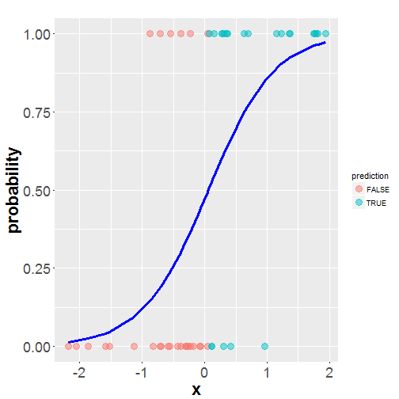

Logistic regression and cross-validation
========================================================
css: index.css

For IODS by Tuomo Nieminen

 
 
 
 

Powered by RMarkdown. The code for this presentation is  [here.](https://github.com/TuomoNieminen/Helsinki-Open-Data-Science/blob/master/docs/logistic_regression.Rpres)

Logistic regression
========================================================
type: prompt
incremental: false

Odds and probability

***

Predicting binary outcomes

A conditional look at regression
========================================================

In regression analysis, the target variable $\boldsymbol{Y}$ is modelled as a linear combination of model parameters and the explanatory variables $\boldsymbol{X}$

$$\boldsymbol{Y} = \boldsymbol{\alpha} + \boldsymbol{\beta}\boldsymbol{X} + \boldsymbol{\epsilon}$$

Another way to express this is to use conditional expectation

$$E[\boldsymbol{Y} \mid \boldsymbol{X}] = \boldsymbol{\alpha} + \boldsymbol{\beta}\boldsymbol{X}$$

So, linear regression is a model for the (conditional) expected value of Y.

Regression for binary outcomes
========================================================

If the target variable Y is binary, taking only the values 0 or 1 with probability $p$, then

$$E[Y] = p$$

- The goal in logistic regression is to define a linear model for the probability of success (Y = 1) $p$.
- The problem is that $p$ only takes on values between 0 and 1

Luckily, there is a trick

The logit function
========================================================
incremental: false

We can apply the *logit function* to the expected value of Y ($p$).

$$log\frac{p}{1 - p} \in [- \infty, \infty]$$

- After the transformation, the possible values are all the real numbers.

***

That's odds
========================================================
One reason to use the logit transformation is that is has a nice interpretation.

- The part $p/1-p$ of the logit transformation are called the odds: the ratio of successes to failures
- Higher odds corresponds to a higher probability of success

***

Odds ratio
========================================================
The ratio of two odds is called the odds ratio.

Intepreting the parameters of logistic regression
========================================================
Example of how to intepret the parameters of logistic regression as odds ratios

Cross-validation
========================================================
type: prompt
