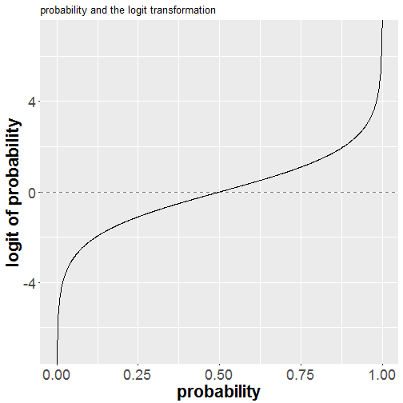

Logistic regression and cross-validation
========================================================
css: index.css
type: sub-section

For IODS by Tuomo Nieminen

<br>
<br>
<br>
<br>

Powered by RMarkdown. The code for this presentation is  [here.](https://github.com/TuomoNieminen/Helsinki-Open-Data-Science/blob/master/docs/logistic_regression.Rpres)


Logistic regression
========================================================
type: prompt
incremental: false

Odds and probability


***

Predicting binary outcomes


A conditional look at regression
========================================================

In regression analysis, the target variable $\boldsymbol{Y}$ is modelled as a linear combination of model parameters and the explanatory variables $\boldsymbol{X}$

$$\boldsymbol{Y} = \boldsymbol{\alpha} + \boldsymbol{\beta}\boldsymbol{X} + \boldsymbol{\epsilon}$$

Another way to express this is to use conditional expectation

$$E[\boldsymbol{Y} \mid \boldsymbol{X}] = \boldsymbol{\alpha} + \boldsymbol{\beta}\boldsymbol{X}$$

So, linear regression is a model for the (conditional) expected value of Y.


Regression for binary outcomes
========================================================

If the target variable $Y$ is *binary*, taking only the values 0 ("failure") or 1 ("success"), with probability $p$, then

$$E[Y] = p$$

- The goal in logistic regression is to define a linear model for the probability of success $p$.
- The problem is that $p$ only takes on values between 0 and 1
- A possible predictor can take on any value. There is no way to use multiplication and addition to restrict the values to a range of 0 and 1.

Odds
========================================================

$p/ (1-p)$ are called the odds: the ratio of successes to failures

- Odds are an alternative way of expressing probabilities
- Higher odds corresponds to a higher probability of success
- The value of odds ranges from zero to infinity

***


*Odds of 2 to 1: the probability of success is twice as likely as the probability of failure when p = 2/3.*


The logit function
========================================================
incremental: false

To transform $p$ into an unrestricted scale, we can apply the *logit function* to the expected value of Y, $p$.

$$log\left( \frac{p}{1 - p} \right) \in [- \infty, \infty]$$

- The logit function is the (natural) logarithm of odds.
- After the transformation, the possible values are all the real numbers.

***



Odds ratio
========================================================

The ratio of two odds is called the odds ratio. It can be computed by following these steps:

1. Compute the odds of 'success' ($Y = 1$) for individuals who have the property $X$. 
2. Compute the odds of 'success' ($Y = 1$) for individuals who do not have property $X$.
3. Divide the odds from step 1 by the odds from step 2 to obtain the odds ratio (OR).

- Odds ratio can be used to quantify the relationship between $X$ and $Y$. - Odds higher than 1 means that $X$ is positively associated with 'success'.

Odds ratio example (1)
========================================================

- *E = "has E"*
- *E_ = "doesn't have E"*
- *1 = "success"*
- *0 = "failure"*


```
   E E_  n
1 10 15 25
0 16  4 20
n 26 19 45
```


***

- $P(Y = 1 \mid E) = 10 / 25 = 0.4$
- $P(Y = 1 \mid E_) = 15 / 25  = 0.6$
- $P(Y = 0 \mid E) = 16 / 20 = 0.8$
- $P(Y = 0 \mid E_) = 4 / 20 = 0.2$  

Odds ratio example (2)
========================================================
Odds is the ratio of successes to failures:

- $Odds(Y \mid E) = P(Y = 1 \mid E) / P(Y = 0 \mid E) = 0.4 / 0.8 = 0.5$
- $Odds(Y \mid E_) = P(Y = 1 \mid E_) / P(Y = 0 \mid E_) = 0.6 / 0.2 = 3$

Odds ratio is the ratio of two odds:

$$\frac{$Odds(Y \mid E)}{Odds(Y \mid E_)} = \frac{0.5}{3} = 1 / 6$$


```
    E E_  n
O  10 15 25
O_ 16  4 20
n  26 19 45
```


Interpreting the parameters of logistic regression
========================================================
Example of how to interpret the parameters of logistic regression as odds ratios here


Cross-validation
========================================================
type: prompt


<small>*Picture from https://prateekvjoshi.files.wordpress.com/2013/06/cross-validation.png*</small>


Train and test sets
========================================================

A statistical model can be used to make predictions. An intuitive way of comparing different models is to test their predictive power on unseed data.

- The available data can be split into training and testing data
- Only the training data is used to find the model
- The testing data is then used to make predictions and evaluate the model

</img>

Cross-validation
========================================================
Cross-validation is a powerful general technique for assessing how the results of a statistical analysis will generalize to an independent data set.  

- Mainly used in settings where one wants to estimate how accurately a predictive model will perform in practice

One round of cross-validation involves 

- Partitioning a sample of data into complementary subsets
- Performing the analysis on one subset (the training set, large)
- Validating the analysis on the other subset (the testing set, small). 


K-fold cross-validation
========================================================

Below is an example of 4-fold cross-validation 


The data is divided into subsets K times, so that eventually all the data has been used for both training and testing.  

<small>*Picture from https://prateekvjoshi.files.wordpress.com/2013/06/cross-validation.png*</small>
