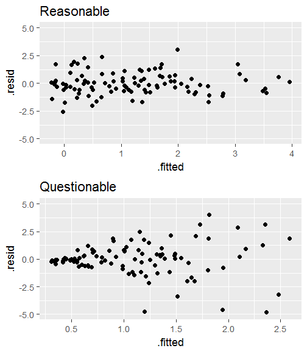

Linear regression and model validation
========================================================
css: index.css

For IODS by Tuomo Nieminen

<br>
<br>
<br>
<br>

The code for this presentation is  [here](https://github.com/TuomoNieminen/Helsinki-Open-Data-Science/blob/master/docs/regression.Rpres)

Linear regression models
========================================================
type: prompt
incremental: false

Simple regression


***

Multiple regression


What is a statistical model?
========================================================

A statistical model: 
- Embodies a set of assumptions and describes the generation of a sample from a population
- Represents the data generating process
- The uncertainty related to a sample of data is described using probability distributions

<!-- source: [wikipedia](https://en.wikipedia.org/wiki/Statistical_model) -->

Linear regression models
========================================================

Linear regression is an approach for modeling the relationship between a dependent variable $\boldsymbol{y}$ and one or more explanatory variables $\boldsymbol{X}$.  

There are many applications for linear models such as

- Prediction or forecasting
- Quantifying the strength of the relationship between $\boldsymbol{y}$ and $\boldsymbol{x}$


Simple regression
========================================================

In a simple case, the model includes one explanatory variable $\boldsymbol{x}$

$\boldsymbol{y} =  \alpha + \beta \boldsymbol{x} + \boldsymbol{\epsilon}$

R:  
```lm(y ~ x)```  

***


Multiple regression
========================================================

The model can also include more than one explanatory variable

$$\boldsymbol{y} = \alpha + \beta_1 \boldsymbol{x}_1 + \beta_2 \boldsymbol{x}_2 + \boldsymbol{\epsilon}$$

R:  
```lm(y ~ x1 + x2)```  

***


Assumptions of linear regression models
========================================================

In linear regression, it is assumed that the relationship between the target variable $\boldsymbol{y}$ and the parameters ($\alpha$, $\boldsymbol{\beta}$) is *linear*:

$$\boldsymbol{y} = \boldsymbol{\alpha} +  \boldsymbol{X} \boldsymbol{\beta} + \boldsymbol{\epsilon}$$

- The goal is to estimate the parameters $\alpha$ and $\boldsymbol{\beta}$, which describe the relationship with the explanatory variables $\boldsymbol{X}$
- An unobservable random variable ($\boldsymbol{\epsilon}$) is assumed to add noise to the observations
- Often it is reasonable to assume $\boldsymbol{\epsilon} \sim N(0, \sigma^2)$

<!-- source: [wikipedia](https://en.wikipedia.org/wiki/Linear_regression) -->

Structure of a linear model
========================================================
In the simple linear equation $\boldsymbol{y} =  \alpha + \beta \boldsymbol{x} + \boldsymbol{\epsilon}$

- $\boldsymbol{y}$ is the target variable: we wish to predict the values of $\boldsymbol{y}$ using the values of $\boldsymbol{x}$.
- $\alpha + \beta \boldsymbol{x}$ is the systematic part of the model.
- $\beta$ quantifies the relationship between $\boldsymbol{y}$ and  $\boldsymbol{x}$.
- $\boldsymbol{\epsilon}$ describes the errors (or the uncertainty) of the model


Finding the model
========================================================
The best model is found by minimizing the prediction errors that the model would make

- $\hat{\boldsymbol{y}} = \hat{\alpha} + \hat{\beta} \boldsymbol{x}$ are the predictions
- $\hat{\boldsymbol{y}} - \boldsymbol{y}$ are the prediction errors, called residuals
- The model is found by minimizing the sum of squared residuals

***


Interpreting the parameters
========================================================
When the model is $$\boldsymbol{y} = \alpha + \beta_1 \boldsymbol{x}_1 + \beta_2 \boldsymbol{x}_2 + \boldsymbol{\epsilon}$$

- The main interest is to estimate the $\boldsymbol{\beta}$ parameters
- Interpretation of an estimate $\hat{\beta_1} = 2$: 
  - When $x_1$ increases by one unit, the average change in $y$ is 2 units, given that the other variables (here $x_2$) do not change.

R linear model summary()
========================================================
class: small-code

<small>
For a quick rundown, see the 'Calling summary' section of [this blog post](http://blog.yhat.com/posts/r-lm-summary.html) or read about coefficients and p-values [here](http://blog.minitab.com/blog/adventures-in-statistics-2/regression-analysis-how-do-i-interpret-r-squared-and-assess-the-goodness-of-fit)
</small>


```

Call:
lm(formula = Y ~ some_variable)

Residuals:
    Min      1Q  Median      3Q     Max 
-5.2528 -1.8261 -0.1636  1.5288  5.8723 

Coefficients:
              Estimate Std. Error t value Pr(>|t|)   
(Intercept)   -0.04364    0.49417  -0.088  0.93026   
some_variable  1.81379    0.58925   3.078  0.00463 **
---
Signif. codes:  0 '***' 0.001 '**' 0.01 '*' 0.05 '.' 0.1 ' ' 1

Residual standard error: 2.643 on 28 degrees of freedom
Multiple R-squared:  0.2528,	Adjusted R-squared:  0.2262 
F-statistic: 9.475 on 1 and 28 DF,  p-value: 0.004626
```

Advanced example: Polynomial terms
========================================================

The linearity assumption isn't as restrictive as one could imagine.  

It is possible to add polynomial terms to the model if the effect of a variable is non-linear

$$\boldsymbol{y} = \alpha + \beta_1 \cdot \boldsymbol{x} + \beta_2 \cdot \boldsymbol{x}^2 + \boldsymbol{\epsilon}$$

R:  
```lm(y ~ x + I(x^2))```  

***


Model validation
========================================================
type: prompt


Model assumptions
========================================================
A statistical model always includes several assumptions which describe the data generating process.  

- How well the model describes the phenomenom of interest, depends on how well the assumptions fit reality.
- In a linear regression model an obvious assumption is linearity: The target variable is modelled as a linear combination of the model parameters.
- Usually it is assumed that the errors are normally distributed.


Assumptions of linear regression models
========================================================
Analyzing the *residuals* of the model provides a method to exlopore the validity of the model assumptions. A lot of interesting assumptions are included in the expression 

$$\boldsymbol{\epsilon} \sim N(0, \sigma^2)$$

- The errors are normally distributed
- The errors are not correlated
- The errors have constant variance, $\sigma^2$
- The size of a given error does not depend on the explanatory variables

Normality of the errors (QQ-plot)
========================================================

QQ-plot of the residuals provides a method to explore the assumption that the errors of the model are normally distributed


Constant variance of errors
========================================================

The constant variance assumption implies that the size of the errors should not depend on the explanatory variables. 

This can be explored with a simple scatter plot of residuals versus model predictions.

**Any** patter in the scatter plot implies a problem with the assumptions

***




Leverage of observations (1)
========================================================

Leverage measures how much impact a single observation has on the model. 

- Residuals vs leverage plot can help identify which observations have an unusually high impact.
- The next two slides show four examples.  
- Each row of two plots defines a *data - model validation* pair.

Leverage of observations (2)
========================================================


Leverage of observations (3)
========================================================


